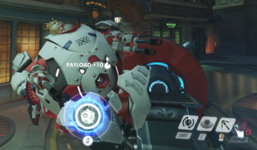
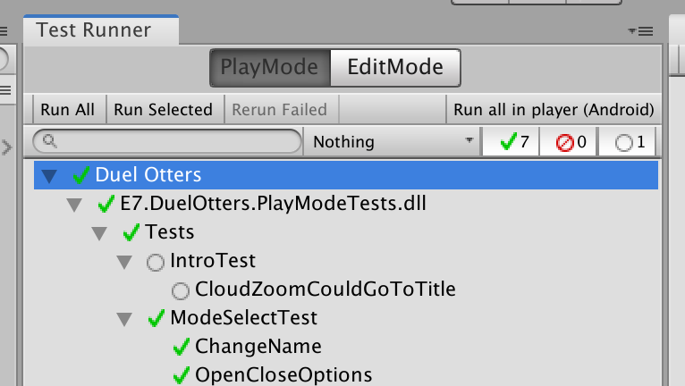
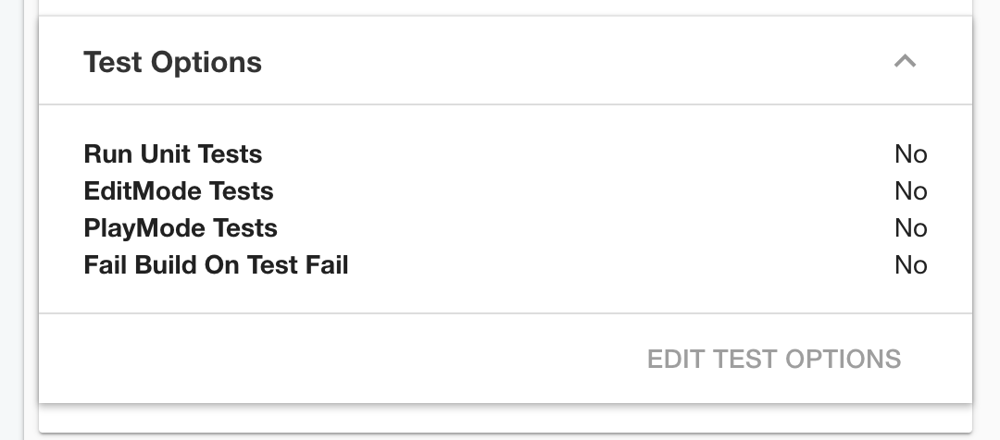
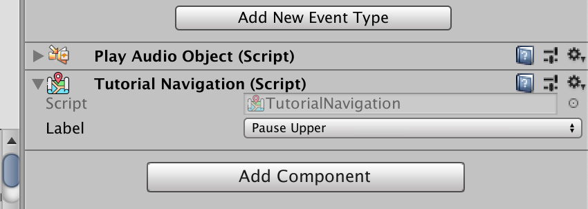

# Minefield Test Tools



`Minefield` is a library (still in-development) to help you program a concise **navigation** play mode test in Unity, plus a guideline to design the game so that it is testable by this library.

It is designed so that you won't have to press play mode button ever again while developing navigation features in the scene. Instead have the Unity Test Runner use `Minefield` to start the scene. If you could make this into a habit, you already have all the tests by the time you finished making the scene. `Minefield` make it easier to stick to this rather than "give in" to the play button because it take less time to write the test, to the point that you could do it while working on the scene which your brain are likely in *creative mode*. Most of the time you give up writing tests because it takes too much time to *sidetrack* and disrupt your scene creation flow.

Because you are still writing pure Unity tests, of course you could use it together with something like [Performance Testing](https://docs.unity3d.com/Packages/com.unity.test-framework.performance@0.1/manual/index.html) package to create a performance test of scenes while navigating around.

## Motivation and emphasis on navigations

Long time ago I have a team of 4 members. Due to bad management often the work pile up on me when others are left idle with nothing to do. Every time I add any new feature, there is fear of regression which could popup somewhere in the game. The solution back then is I would ask Ben, my teammate : "We will ship this soon, you are currently free so could you **go to all scenes and push all buttons** in the game?" This "make sure everything works by mindlessly navigating around" test happen every release. And I believe almost all kind of games need this assurance, regardless of genre or the game's content. More specific tests like checking correctness of game variables or presentation comes later. (Which Minefield could also help to some degree, but not its the main design.)

Fast forward to now, others all quit and got far more stable day job. No amount of money I could offer to them that's worth their *time* anymore compared to what they could earn. Because time is money, what if I could get more of my own time to compensate? An automated testing library that could make *that kind of test* as fast as possible is the solution to survive alone. It may not be able to query and check for everything in Unity, and it may not able to do mocks, stubs, doubles, fakes, etc. But it has to be the fastest to code up a mindless navigation test.

The original requirements "go to all scenes and push all buttons" are satisfied by 2 main design of `Minefield` : an ability to use a single scene as a unit of test, and an ability to navigate when able to or otherwise wait for it.

## Design

This is an example of a complete test that try to go from title to mode select, select training mode, wait until character select screen comes up and ready, then check that there is no portrait for the 2nd player because it is a single player mode.

```csharp
using System.Collections;
using UnityEngine.TestTools;
using E7.Minefield;

public class SampleMinefieldTest : SceneTest
{
  //A primary unit of testing in Minefield is a scene. It could start any scene specified here cleanly.
  protected override string Scene => "Title";

  //All cases in this class test the same scene.
  [UnityTest]
  public IEnumerator TitleToModeSelectToTrainingNoUpperCharacter()
  {
    yield return ActivateScene();
    yield return Beacon.ClickWhen(TitleScreen.Navigation.TouchAnywhere, Is.Clickable);
    yield return Beacon.ClickWhen(ModeSelectScreen.Navigation.EnterTrainingMode, Is.Clickable);
    yield return Beacon.WaitUntil(CharacterSelectScreen.Navigation.ConfirmCharacter, Is.Clickable);
    Assert.Beacon(CharacterSelectScreen.Beacon.PlayerTwoCharacter, Is.Inactive);
  }
}
```

### Scene as a unit of test

One stand out feature is that `Scene`. Minefield consider a scene as one testable unit. Therefore not every kind of game is "testable" by Minefield, for example, if your game is composed of multiple active scenes, and each of those do not work on their own, can't advance without the other scene present, or throws errors. I have provided some guidelines to make the game testable by Minefield below.

Now, the strength of this approach is that you could write multiple cases per scene without specifying the scene name to load on every test case, thanks to test subclassing scheme. This make it possible to organize your tests into one class per scene which is very logical. The explicit `ActivateScene()` call is an intentional design that allows you to modify any context that would influence the test in your own `[SetUp]` or `[UnitySetUp]` before it starts. You can even turn each case into a super play mode button that set the stage to what you want consistently every time.

### Test metadata

A defining feature is the test **beacon**, which allows you to use an easy to understand `enum` that you declared yourself to navigate the scene without knowing any game object's name or any animation length to wait for, the major pain point on writing play mode test. This make the test loosely coupled with the scene in the sense that your scene maybe extremely complex, but the test could remain a very simple series of wait-and-clicks.

The `enum` is linked to scene object by a special `MonoBehaviour` carrying this `enum` serialized together with your scene. It prevents brittle test that would be the case if you try to assert for hard-coded object name or getting some specific component type, at the price of testing library being a bit invasive in your actual game. On the bright side, you will be adding these as you build the game and they will help you think about all possible navigation scenario that could occur in a scene. Plus it allows you to use object search box in Scene view to find and manage all beacons easily. Other editor toolings in the future could be extended from these beacon components.

`enum` also provides advantage of intellisense popup, and IDE symbol searching that roughly tells you about code coverage, or easily find missing part that needs some tests.

Later you will also learn about **reporters**, which is an another metadata to add to the code to reduce friction in asserting for values of things in the scene. Together, the object is pinpointed with a beacon, then assert by querying the reporters on it.

The theme of Minefield is that by adding some **test metadata** into your actual game, we could drastically reduce an amount of code to write in the test. And because test code are repeated many times per case written, this trade is very reasonable and it will encourage you to provide more coverage. Instead of considering them as noises from the testing library that spill onto your game objects, think of them as a *necessary* components to make a complete (i.e. testable) game even though at runtime you will not use them at all.

### Loose design reduces test code maintenance

Testing by beacon navigation is also loose enough to my liking. I often don't need to look around for everything on every step, these defined beacons are now all possible choice I should cover instead of having to use `GetComponent<?>` and think what *else* should I test. If something is not of interest, it should not be defined as a beacon in the first place.

When you move around your game objects in the scene, of course the beacon component goes with them as per usual Unity, so you have easier time maintaining the test code. If you do `Transform` hierarchy crawling in the test to get to your destination, eventually you will be scared to change because you don't want to refactor the test and moreover there is no compile error triggered at all. Minefield will give confidence and at the same time don't limit creativity freedom that much when you need to change something in the scene.

Beacons works well with 2018.3 new prefab workflow, because component could be an override at any level. In the case that you have multiple instances or variants of the prefab on the scene, you could vary the beacon as overrides to discern game objects in the test. Before, you may have to name your object explicitly as something and use it in the test, or try to search for a component type. That will eventually produces duplicate entries when you continue making your scene with more nested prefabs, which started with the same name and components.

Often when writing "graphical" test like this, it is difficult to picture where you are right now in the head. Writing Minefield tests take that away, because just look at a list of beacons you defined yourself the scene became clear like you are holding a map.

`GameObject` and uGUI was not quite testable by design. They are fixing this with the new DOTS Entity Component System where each system code are a lot more test-friendly in isolation. For now I think this "hack" combined with scene-as-a-unit test is the most reasonable one. 

## Requirements

- .NET 4.x : C# 7.3 needed for `Enum` generic constraints, `is` pattern matching expression, and expression bodied methods.
- `asmdef` support, the project is properly excluded from your actual game with Test Assembly checkbox, without `asmdef` it will be in your game since I don't want to litter preprocessor directives everywhere.
- Addressable Asset System package : The test could use the name you provided as either regular scene name or AAS key that should lead to the scene.
- Unity 2019.1 : `asmdef` version define feature so I could exclude AAS code from the library if you don't use AAS in the project.

## How to include

Clone it and use `+` button in your Package Manager menu to look for `package.json`, or use GitHub include by adding this line to your `manifest.json` :

```json
"com.e7.minefield": "git://github.com/5argon/Minefield.git"
```

It does not update automatically when I push fixes to this repo. You must remove the `lock` section that appears in you `manifest.json` file to refectch.

Then,

- `E7.Minefield` : Link your game `asmdef` to this.
- `E7.Minefield.TestTools` : Link your test `asmdef` to this.
- Finally, go to `manifest.json` and include this at the end.

```json
  "testables":[
    "com.e7.minefield"
  ],
```

Reasons for the need of `manifest.json` modification :

### Testing assembly problems

- Reference from `asmdef` to `UnityEngine.TestTools` and `NUnit.Framework` is strictly for `asmdef` that is checked as "Test Assembly".
- Of course `Minefield` as a test tools extension need those to call `Assert` and such for you. So `E7.Minefield.TestTools` has "Test Assembly" on.
- There is a rule that linking "Test Assembly" `asmdef` in you game to `asmdef` in packages with also "Test Assembly" status has no effect. This had been a problem with trying to include ECS's base class for testing fo so long too. In effect, "test tools extension assembly" simply cannot be done in Unity.
- However there is a kinda hack with `testables` in your game's `manifest.json`. Its real intention seems to be so that your game's test includes the listed package's tests too. `Minefield` is a test **tools**, and contains no actual test for itself, however, `testables` have a side effect that it make your game able to link up "Test Assembly". And now it is luckily that `Minefield` doesn't have any tests for itself, this became the official way to use it. (An opposite to ECS's test assembly, just wanting to use those classes will pollute your project with ECS tests.)

## Minefield's guideline for testable Unity project

### A scene for testable unit, a prefab for content composition

- A **single** `Scene` is a testable unit. Don't make it a scene if you think you can't test on it individually, instead, use the improved prefabs from 2018.3 to compose your content rather than multiple scenes. If your game is composed of multiple scenes and you always work on multiple scenes in edit mode for example, it is likely going against this library. Either refactor to comply or see [other Unity testing library alternatives](https://forum.unity.com/threads/what-options-do-i-have-for-automation-and-unit-testing-in-unity.682720/).
- All scenes must work by itself under `LoadSceneMode.Single`, avoid `LoadSceneMode.Additive`. You should **not** compose your scene such that it includes multiple additive scenes, even if all that may started from loading a single scene. That scheme may be tempting in the past, but it make your project less testable, and also we now have 2018.3 nested prefabs to facilitate assembling scene from multiple pieces. Do not use an another scene as those pieces. Note that non-additive scene could still be loaded asynchronously, only that when it activates it will clean up previous game objects. (Actually, the backend of improved prefabs is reusing the scene data structure! Every prefabs are scenes now.)
- You will not ever be setting which scene is an active scene because you always have 1 scene. And `Minefield` assumes the active scene is the one you are testing and cleanly destroy everything in between tests. It is difficult to clean up a scene in-between test fast (and truly cleanly) if there is no guidelines about this.
- All scenes must be able to pass a test by just loading it without touching anything else and wait for a bit. With this design you are able to make a "lazy man's test" by just try loading each individual scene. Some design that prevents this is a scene which require other scenes to function, which if you followed the guideline such scene doesn't exist.
- In normal development, it must be possible to press play mode on any scene and start playing from that scene, no matter how "wrong" that may felt to you regarding to game's status on starting that scene. For example, if the final boss room is a scene, you should be able to start from that scene even if the character will be at level 1. It is more important to make sure that it is not an error. The "state" of the scene will instead be controlled by a `static` variable, more in the next topic.

### A `static` variable to influence the entire scene

A scene may only change its starting behaviour due to **external** `static` variables.

I was once a developer who allergic to `static` and use stunts like `DontDestroyOnLoad` game object to pass values between scenes, or use `ScriptableObject` (and that kinda make a "disk-static" variable anyways), or use singleton pattern which instantiate a non `static` object from `static` entry point. Turns out, what I wanted all along perfectly fits the definition of `static` in the first place. No reason to avoid just because "`static` is evil" as commonly misunderstood. It's also not a cheat, or dirty/unorderly programming. It's a design tool available in C# for use.

- `static` represent a single place source of data. And that's a very powerful trait for predicatable and testable design because all could access the variable equally. What works in the test directly translates to the real thing. But in exchange of residual values problem, which is considered a bug and you have to clean them up properly. Think of it as a native resource, you carefully manage it as opposed to instance variables which you could leave it to garbage collector or stack/code scope to reset them.
- It must be possible to hack up this `static` variable before starting the scene to produce every kind of possible outcomes. For example, if your title screen is planned to be playing full intro on starting the game, but skipping intro if you back to it from mode select menu, you must have only a `bool` in your `static` that determines the outcome should the title plays intro or not. You should not try to figure out what is the previous scene, also the previous scene should not try to access the destination scene's content. Instead the previous scene will modify this `static` `bool` and title screen doesn't have to be aware who modified it.
- This `static` variable will be on a different `asmdef` that the scene refers to. In effect due to circular dependency restriction, the `static` variable has no knowledge of any scene's `asmdef`. (Other than variable naming which could be the name of scene that will take the variable) The restriction will force you to not use any scene specific data type on this `static` variable and use more primitive fields. You may use scene-agnostic data type such as your struct that represent player's save data, or various "manager" structs.
- You should keep your static full of `struct` because it allows you to have a usable default value without initialization. It is annoying to find a place to instantiate `static` variable if you have any `class` type in it, because it feels like there is no proper place. Sometimes you want to use `List` for example and it is unavoidable. In that case you could use `[RuntimeInitializeOnLoad]`, but remember that unit tests will not run through this and you must manually instantiate. (However play mode tests do.) One other solution is wrapping any part of it with `class` and have a `null` check, if `null` then instantiate a new one.
- There should be no `static` variable configuration that produces error on starting any scene, even default values. Nested `class` type usually produces `null` that your scene code didn't prepared for.
- You should not rely on leftover `GameObject` passed from the previous scenes.
- You should not make an inspector exposed public field on some objects in the scene in order to customize its starting behaviour. To customize starting behaviour as you iterate your game, make a `[RuntimeInitializeOnLoad]` script that hack and change the `static` variable before your scene loads. The scene should not be aware of this script, it should just load from whatever in the `static` variable at that time. If you need inspector GUI to do this, make a `ScriptableObject` in `Resources` then load and migrate its value to the `static` variable in your `[RuntimeInitializeOnLoad]`.
- You should not rely on loading persistent file from disk. That file must be loaded and put into the `static` variable for the scene to read. If this load must be done every time as a saved player data for example, this logic should not be in any of scene's game object `Awake` or `Start` (the so-called "entry point") but instead you must use `[RuntimeInitializeOnLoad]` for the real entry point, so the code become scene-agnostic. You may `if` the scene name with `SceneManager` in this code in order to do it on only certain scene, as a workaround for not being able to use that scene's game objects.
- All this is for that in testing code we have no GUI. We will be configuring by replacing the `static` variable with desired values and starting the scene over and over. If you design your `static` right, all possible outcomes will be covered.
- The scene cannot have a logic that hack and change **its own** `static` variable, the scene can only change other scene's `static` variable in order to navigate to that scene. Some exceptions including transition to the same scene, for example changing game's language and you want to refresh the scene.
- Instead of `static` adjustment before starting the scene, it is also acceptable to vary scene's behaviour by making a [prefab variant](https://docs.unity3d.com/Manual/PrefabVariants.html) with small difference, then put it on a different scene. For example :
    - I have a character select screen which is a bit different depends on if you come here on single player or two players mode. Instead of a `bool isTwoPlayers;` on the `static`, I could make a big prefab for use in two players mode first and name the scene `TwoPlayerCharacterSelect`.
    - Then make a variant of that big prefab that set inactive the right side character selector, then put that variant in a new scene called `SinglePlayerCharacterSelect`. This way, you are still using prefabs to compose your game in a way that it is maintainable. (Changes on either one should reflect to the other)
    - And also each scene is still a test unit according to the guidelines. In some case it may be better that you could explicitly say in the test that you want to test the single player one or two players one by scene name.
    - One other benefit is that at design time you could quickly switch between 2 variants and visually see the design, because `static` way only works at runtime. `static` is still needed for further adjusting details of the scene in dynamic way, such as unlocked characters.

With this design, you could eliminate the kind of test that start from the beginning of your game and go in multiple steps in order to arrive at the destination scene and do things. Because you fear if doing so would have any side effects that is different from just testing the scene individually or not.

Limiting the side-effect to `static`, you can test in each scene, and just 1 level of that scene's transition to the other scene. For example if you have a scene A -> B -> C, you don't have a test that starts at A and try to go to C. Just A -> B, then B -> C.

### Keeping game's navigation in check

Games are full of **animation and transitions**, bugs in this area includes that user may able to do something when you don't want them to. This guideline is that you must properly **prevent** navigation game objects from being clicked when appropriate, like mid-transition. One common place for this kind of error is the first/last frame where you are going to disable things but it is still possible to interact in that frame.

In manual testing, some way is "can you break this test" where you have a user randomly spam the interested object or even an entire screen at all times to see if no strange behaviour occurs.

In automated testing, the test is able to simulate a fake click. However, one of a big test pain point I found is that it is difficult to blindly wait for x seconds and hope that the simulated click will go through. This wait may be more than necessary and adds test time, or less than necessary and cause test bugs that the click hits the air and does nothing.

How could automated test do an equivalent of manual "can you break this" test? I believe the correct approach is the test should repeatedly **try** to interact the interested object every frame until it is able to. This way it is even better than manual test since there is no missed frames. With `Minefield`, the test has several "wait until clickable (then click it)" methods that help waiting for these transitions, **without the test knowing transition length**. Next, you will learn what exact condition `Minefield` checks and wait for the click.

- If the player could do something at any moment, then so could the test. If this breaks the game then you have found a bug such as able to interact while the screen transition or on the first/clutch frame. As a principle, `Minefield` has some methods try every frame to click it until it is fine to click. You can choose to actually interact it or just wait for it.
- If navigational component was designed with uGUI's `IPointerDown/Up/ClickHandler`, (e.g. `EventTrigger`) if a raycast could hit it **the first**, the test will assume that it is now safe to simulate a click. You can prevent this by :
    - Parent `CanvasGroup` with `blocksRaycasts` as `false`.
    - Setting `raycastTarget` on your `Graphic`.
    - Make the ray receiver component disabled.
    - Make the ray receiver game object inactive.
    - Put something else on top like an 0 alpha `Image` that blocks raycasts, so your object is no longer the first to receive a raycast. This is common for popup dialog which may use transparent or darkened backgroud to prevent everything behind from being touched while the dialog is open.
- Additionally, if navigational component was designed with uGUI's `Selectable` component, it's `IsInteractable()` status should be prevented appropriately when player shouldn't be able to interact with it. In this case, it **do blocks raycasts** but nothing will happen if you click it for real in the game. Because of this if you have `Selectable`, `Minefield` will add one more criteria that it must also be `interactable`. You could prevent this by : 
    - Parent `CanvasGroup` with `interactable` as `false`.
    - Set `interactable` on your `Selectable` as `false`.

### Ensure all Unity's test-related toolings are working



This **Run all in player** button is very useful as you could connect a device, press it, and left it alone without any further intervention. [In the future](https://forum.unity.com/threads/feedback-for-logassert-class.530539/#post-4559518) it is also going to be possible to just make a test build without device connected so you could distribute it to test farms like [Firebase Test Lab](https://firebase.google.com/docs/test-lab).

For now, let's make sure you have no fear of pressing this button every night before going to sleep. With `Minefield` you maybe able to create some good tests already, but something that may prevent this includes :

- Relying on bundle name. The bundle name is set to `com.UnityTestRunner.UnityTestRunner` automatically, it could break something like Firebase Unity API.
- Relying on `DEVELOPMENT_BUILD` preprocessor directive. The button will turn on `DEVELOPMENT_BUILD` and your game should execute properly with this directive on.
- Relying on manual post-build hacking, because this button currently send the build straight to the device.

Got 9$ a month to spare? If you have [Unity Teams Advanced](https://unity3d.com/teams), you will also be able to utilize [Unity Cloud Build](https://unity3d.com/unity/features/cloud-build)'s auto test per-build feature.



# Walkthrough

After following the guidelines, you will be able to use `Minefield` for the following benefits.

## Assembly planning

You will have 3 kind of `asmdef` :

1. Core `asmdef` containing `static` variable that influences each scene in your game, among other things.
2. Scene `asmdef` referencing to core `asmdef` in order to access the `static` variable, or modify the `static` variable to make the next scene behave the way it wats.
3. Test `asmdef` referencing also to core `asmdef` to change the `static` variable before each test. It may optionally reference scene `asmdef`.

However even if you reference your scene `asmdef`, asserting on exposed fields of things is not a good design for test, since in the end you will use them as necessary portals to jump to the thing you actually want to test rather than wanted to test on them, and later you may introduced new exposed field just because you can't go to the desired things to test. This kind of "for test" exposed field should be avoided. (And actually exposed fields should be `[SerializeField] private` rather than `public`, so you can't use them from tests anyway.)

## `SceneTest`

By subclassing from this class in your test assembly :

- Each subclass will be a test for a single scene. You will have to provide your scene name because the `abstract` variable will ask you to.
- Each test case will be a fresh start of this scene. The built-in `[SetUp]` and `[TearDown]` will take care of everything for you.
- You will need to call `ActivateScene()` `protected` method **manually**. This design gives you an opportunity to hack up the `static` variable before allowing the scene to start, while don't have to specify the scene name on every test case because the subclass already asked you for it.
- Before your test case even begin the scene is already waited and 100% loaded thanks to `[UnitySetUp]`, and only needs an activation. Other scenes you may want to load in the test needs a proper wait but as the guideline says you shouldn't have to compose the test from multiple scenes to get along with `Minefield`.
- As in C# in general `static` variable do not reset in-between multiple test cases, **it will carry over**, because there is no domain reload in-between. (It is a good thing because the reload cost big performance hit.) You should always setup your `static` variable even though you think you don't want any particular value. In fact you may want a default, so you should set it to `default`/`new` instead of doing nothing. Do this in your own `[SetUp]` or `[UnitySetUp]` in your subclass.

After starting the scene you will want to check up on something or navigate inside the scene. We have no GUI in writing tests and it is difficult to use methods like `GameObject.Find` or `FindObjectOfType` to get the desired object to test "blindly". It is even more difficult to navigate "at the right time" when you could see nothing while writing a test. For this I have designed something called a **beacon**.

## Test beacons

This is a way to use `enum` to refer to `GameObject` in your scene, by "attaching the `enum`" to it. Attaching an `enum` is possible by a `MonoBehaviour` carrying that `enum`.

It make writing a test more fun because `enum` could be auto completed and self described, rather than having to use something like `GameObject.Find` which rely on object's `string` name that may be refactored without the test updating along. `enum` could be mass-refactored by most code editors.

### Label declaration

To use beacons, first you will declare some `enum` that represents all possible actions in the scene. This is called a beacon's **label**. This is like Flux or Redux's action string if you do front end dev, however they could also represent any test checking point and doesn't have to be strictly "action". Other than they will help us test, it is an overview of what's possible, and a checklist if you are missing any tests or not.

You can nest the definition in one of your class so you could reuse name. For example I would like to always name it `Navigation` but there are different `Navigation` on the other scenes.

```csharp
public class ModeSelectScreen : MonoBehaviour
{
    public enum Navigation
    {
        SwitchCharacter,
        ChangeName,
        Garden,
        TwoPlayers,
        EndlessParty,
        ThreeWins,
        Training,
        Arcade,
        ShowOption,
        HideOption,
        ChangeLanguage,
        APRanking,
        Back
    }
    ...
```

(Do not put a new entry inbetween the old ones afterwards, Unity serialize by `int` value and it will make old serialized value wrong. You could use an explicit integer to pin the value.)

### Subclass an attachable beacon component of that kind of label

Next, declare a new class with that `enum` as a generic of either `NavigationBeacon<>` if it is intended to be clicked on by uGUI event system, or `LabelBeacon<>` for any `GameObject` you want to access or assert easily in the test. You should gain a serializable `enum` field of your type which shows up in editor. Remember to put them in a separated file as per Unity's attachable script rule, so they each get their own `meta` and GUID.

```csharp
using E7.Minefield;
public class ModeSelectBeacon : LabelBeacon<ModeSelectScreen.Beacon> { }
```

```csharp
using E7.Minefield;
public class ModeSelectNavigationBeacon : NavigationBeacon<ModeSelectScreen.Navigation> { }
```

You are now ready to attach these new component classes to any `GameObject` in the scene. If it is a `NavigationBeacon<>`, the point of attach should be the raycast receiving elements, which depends if you got a `Button`, `EventTrigger`, or something else. The test tools can help you click on these objects. If `LabelBeacon<>`, then it could be any `GameObject`.

### Script icon tools



By selecting `Assets > Minefield > Auto-assign all script icons`, all your subclasses of `NavigationBeacon<>` or `LabelBeacon<>` will get an icon so they became more obvious in the Inspector.

### Other beacon management tricks

As a bonus you could try typing `LabelBeacon` or `NavigationBeacon` in the Scene view search box to return all beacons added so far. This is possible because each generic class you subclassed from is a subclass of non-generic version. The only purpose of this is for this use case because the search box couldn't list a generic class derived class even if the derived class has no generic type param, and it also could not search interfaces.

### `HandlerBeacon`

Actually the class hierarchy goes like this : `NavigationBeacon` : `HandlerBeacon` : `LabelBeacon`. You use `HandlerBeacon` like `NavigationBeacon`, except that thing is not really for navigating the scene. For example an on-screen jump button on endless runner game should be a `HandlerBeacon` instead if you want it to be testable.

Functionally it is no different and you could simulate a click the same way, but some functionality planned in the future will be exclusive to navigation. For example, automatic Firebase Analytics integration to log how your user interact with your game. It doesn't make much sense to log each jump button press that would be pressed thousand of times per session.

## Navigation with beacons

We have finished our business with the scene and now ready to write some tests. Make sure that in the test, you don't have to dig up any other objects that doesn't have a beacon. It is the best if your test contains only beacon queries.

Navigation is available from `static` class entry point `Beacon.___`, which all of them require an `enum` as its argument, this `enum` must be on a beacon of type `NavigationBeacon<>`. Then you follow with NUnit 3 style constraint started from `Is.___`.

You may not have to assert anything at all to test navigation. If it doesn't throw any error, then the test had already helped you.

This is an example of tests of my title scene. Started normally you could click on an `EventTrigger` "Touch to start" text to go to the next scene, and if the `static` contains an instruction to skip you are immediately skipped to the next scene (with some special transition that's not exactly the same as clicking "Touch to start".

The test could be completed by only `Beacon` calls.

```csharp
using System.Collections;
using UnityEngine.TestTools;
using E7.Minefield;

public class TitleSceneTest : SceneTest
{
  protected override string Scene => "Title";

  [UnityTest]
  public IEnumerator TouchToStartGoToModeSelect()
  {
    yield return ActivateScene();
    yield return Beacon.ClickWhen(TitleLogic.Navigation.TouchToStart, Is.Clickable);
    yield return Beacon.WaitUntil(ModeSelectScreen.Navigation.Training, Is.Clickable);
  }

  [UnityTest]
  public IEnumerator SkippingToModeSelect()
  {
    //Hacking the static variable to influence scene's behaviour, according to the guideline.
    SceneOptions.title = new SceneOptions.Title
    {
        titleMode = SceneOptions.Title.TitleMode.SkipToModeSelect
    };
    yield return ActivateScene();
    yield return Beacon.WaitUntil(ModeSelectScreen.Navigation.Training, Is.Clickable);
  }
}
```

You may not see any `Assert`, but the final `WaitUntil` plus `Is.Clickable` constraint itself is already an implicit assertion that player could arrive at the destination. If that didn't go on, the test will fail from the timeout. `WaitUntil` `Is.Clickable` could also catch one common bug where things are unintentionally clickable in the first `Awake`/`Start` frame because it tries repeatedly.

A `Click` is a simulation of pointer down, **wait a frame**, and pointer up plus pointer click together in the next frame. So `yield return` is required because it is not an instantaneous action. Inside those methods, navigations are simulated by recreating the same `EventSystem` raycasting routine from `UnityEngine.UI` namespace that is used by real player, referenced from the [`UnityEngine.UI` repository](https://bitbucket.org/Unity-Technologies/ui).

There are also various utilities that are not related to beacons available in `Utility` `static` class, like waiting for some `GameObject` to became active. They are used by the `Beacon` static class themselves, but in most cases you should try to stick to only `Beacon` class since that signifies that your beacon is enough or not.

## Assertion

Sometimes you don't want to just navigate around and call it a day. `Assert.Beacon` is the entry point to assert a beacon. The `Is.___`  is emulating NUnit 3's constraint model style, however it is not an entirely a complete extension. (So you can't really combine with every NUnit's expression, like `Is.Not.Active` for example.) This is called Minefield-only constraints.

```csharp
Assert.Beacon(beacon, Is.Active);
Assert.Beacon(beacon, Is.Inactive);
```

### Stuff you could do

For use with `yield return` while in a test :

```csharp
Beacon.WaitUntil(____, Is.____);

// Fail the test immediately if the beacon to click is not found or inactive.
Beacon.Click(____);

// Continue to wait for a click. The test could still fail with timeout if it is not able to click for a long time.
Beacon.ClickWhen(____, Is.____);

// This is useful to create a "dumb AI" where normally complex actions are required to get through the scene, 
// but a simple spam without considering any timing could also do so in a less ideal way.
Beacon.SpamUntil(____, Is.____, spamAction);
Beacon.SpamWhile(____, Is.____, spamAction);
```

Assert with Minefield-only constraints : 

```csharp
// Instead of asserting and fail immediately, just return a bool.
// Useful in creating a `break` case in a `while` loop, etc.
Beacon.Check(____, Is.____);

// A shortcut for `Assert.That(Beacon.Check(____, Is.____))`
Assert.Beacon(____, Is.____);
```

Assert with regular NUnit `Assert.That` and NUnit constraints :

```csharp
// Get the `GameObject` with the beacon to do anything you want.
Beacon.Get(____);

// Same as doing the Get above then `.GetComponent` on the returned game object, in a single command.
Beacon.GetComponent<T>(____);

// For example it is common that you may want to check up some text content currently displaying.
// By having a beacon on game object with TextMeshPro, you could : 
// Assert.That(Beacon.GetComponent<TMP_Text>(____).text, Does.Contain(____));
```

### Using `[Values]`

In NUnit, [`[Values(...)]`](https://github.com/nunit/docs/wiki/Values-Attribute) normally could be used to create a parameterized test with specified values as each case, automatically permutated if multiple. However just `[Values]` with no values specified at all has [special use for `bool` and `Enum` data type](https://github.com/nunit/docs/wiki/Values-Attribute#values-with-enum-or-boolean). Because these has reasonable finite possible values, all the cases could be generated automatically.

Because a beacon label is an `Enum`, you could easily have a test that "try everything" with very little code. For example a language selection screen, you want to test if each language button works or not by looking at some text in the next screen after pressing it. Languages are sensitive to game resource so testing just one language isn't enough. (e.g. you added a new language, but forgot to add fonts then it fail only on that language.)

If you made a navigation beacon for each language's button, you can create this test `SelectLanguageAndCheckTranslatedTitleScreen( [Values] LanguageScreenNavigation beaconLabels )` and cases that try each button will all automatically be there.

## Reporters

A collection of `interface` you could add to your `MonoBehavior` to assert more customized things. You could think of it as an even more **hack**, a test metadata added to your code. But it is better than either having to expose `public` for the purpose of test and ruin the class design, or try to use hierarchy traversal methods to climb the object tree blindly. This way it is explicit that these are for `Minefield`. Use it if you could accept the hack.

The assertion on reporters will be via `Is.Reporting.___` fluent assertion API. Though when English grammar permits, some are accessible from `Is.___` as well.

### `IMinefieldOnOffReporter`

Allows you to assert with `Is.On` and `Is.Off` (or `Is.Reporting.On` and `Is.Reporting.Off`) as a customized way to check for status of something in the scene that is difficult to put in words... or just not enough to check on its game object active status. You provide by yourself what is considered "on".

For example this class uses `.enabled` to show-hide its members and `Is.Inactive` won't be able to detect its "invisible" status since it check on the game object's active. Instead, I could have it reports a custom `IsOn` condition and use `Is.Off` in the assertion instead of `Is.Inactive`.

```csharp
public class APHint : MonoBehaviour, IMinefieldOnOffReporter
{
    public Image starImage;
    public TextMeshProUGUI numberText;
    public PlayableDirector showDirector;

    public bool IsOn => starImage.enabled && numberText.enabled;

    public void Set(int apAmount)
    {
        if (apAmount != 0)
        {
            starImage.enabled = true;
            numberText.enabled = true;
            numberText.text = $"+{apAmount.ToString()}";
            showDirector.Stop();
            showDirector.Play();
        }
        else
        {
            Hide();
        }
    }

    public void Hide()
    {
        starImage.enabled = false;
        numberText.enabled = false;
    }
}
```

### `IMinefieldAmountReporter` 

Used with `Is.Reporting.Amount(expectedAmount)` for generic integer check. An example of this is a health indicator that display colored heart icons and hollowed black hearts for diminished health. It is too messy to try to "count the colored heart" from test (I did that "properly" before and it was hell) and this so-called "hack" results in a more concise test code when the health indicator could report its `Amount` of remaining health.

An example of `Is.Reporting` fluent assertion API usage combined with amount reporter :

```csharp
[UnityTest]
public IEnumerator ScoreCounter()
{
    //Static hacking before scene start, according to the guidelines.
    SceneOptions.gameSelector.matchManager.RegisterGame(GameInfoList.Instance.GetInfoWithName("Hockey"));
    SceneOptions.gameSelector.matchManager.RecordScoreOfLastGame(1, 0, winner: PlayingSide.Lower);
    SceneOptions.gameSelector.matchManager.RegisterGame(GameInfoList.Instance.GetInfoWithName("PerspectiveBaseball"));
    SceneOptions.gameSelector.matchManager.RecordScoreOfLastGame(1, 0, winner: PlayingSide.Lower);
    SceneOptions.gameSelector.matchManager.RegisterGame(GameInfoList.Instance.GetInfoWithName("BombFortress"));
    SceneOptions.gameSelector.matchManager.RecordScoreOfLastGame(0, 1, winner: PlayingSide.Upper);
    yield return ActivateScene();

    yield return Beacon.WaitUntil(GameSelector.Navigation.BackLower, Is.Clickable);
    Assert.Beacon(GameSelector.Beacon.LowerScoreCounter, Is.Reporting.Amount(2));
    Assert.Beacon(GameSelector.Beacon.UpperScoreCounter, Is.Reporting.Amount(1));
}
```

### `IMinefieldStatusReporter<T>`

The `T` has been constrained as `Enum`, and you must provide `T Status` of that type. This is because a limited choice of `enum` is often used as a summarized, current overall state of something. In the assertion, this one is a bit special because you could use either `Is.Currently(___)` or `Is.Reporting.Status(___)`. Wording is a bit different and could fit on different scenario.

(For example if your character could be `Pink` or `Green` you would use `Is.Currently(___)`, but if you are asserting an icon of internet connection status you may want to use `Is.Reporting.Status(___)` for grammar's sake.)

### `IMinefieldObjectReporter<T>`

Pretty much could report anything but make sure no other choice exist before falling back to this, since you will need to assert with `Is.Reporting.Object(___)` which may not be aesthetically pleasing to read if that thing doesn't feel like an "object" in programming sense. (e.g. `int` which you could instead use `IMinefieldAmountReporter`.) The equality test is by `object.Equals`.

## Minefield as a play button replacement

You could turn your Test Runner tab into a play button galore! Test cases are now your active development/design iteration tools and no more just to prevent regressions. This has several advantages :

- No need to dig your huge Project tab and go to the correct scene before you could try something, because `SceneTest` itself knows how to start the scene just from the test case.
- You could start with any desired data state, since Minefield allows you to do anything before explicitly doing `ActivateScene()`, while in normal play mode button press you get no chance to do custom things at all before your `Awake` and that maybe already too late or requiring extra hacks to alter script execution order. Well, `[RuntimeInitializeOnLoad(RuntimeInitializeLoadType.BeforeSceneLoad)]` exists, but not ideal since it applies permanently to the whole project and to all play mode tests.
    - An example of problem is when you made a Facebook page liking system which then unlocks something in the game permanently after coming back. (Saved in serialized binary or `PlayerPrefs`.) It is a hassle if you just press play mode button since you could do it only once according to your game logic.
    - You then need to reset your save every time to test it again, when you add something more to it. (For example, new visual effects after coming back from Facebook for the first time.)
    - You could write a save reset in `[RuntimeInitializeOnLoad]`, but in other situations you will want your save file to be at some intermediate state to test out and now your reset code is not desirable. Setup per test case is the true solution, plus you got a test to run later to check for regression. Nothing to lose other than you have to break the habit of pressing that play button.
- Minefield navigation methods could lend you a hand to go to the place you want before handing the control to you.
    - An example situation, you are making backpack inventory screen system. But by how it was wired up with the game it is hard to instantly start at this backpack screen with everything functional. (That is, it is hard to test separately since it is not a scene but perhaps a prefab) To test it meaningfully you have to start the game normally, press button to open menu, and select "backpack" choice before you even get to test how things you are making works. (Scrolling properly? Displaying properly?) You will encounter some bugs, and it will get progressively tiring to navigate to the backpack.

To do this Minefield provide you 2 things : `[NoTimeout]` to put on the test method, and `yield return Utility.WaitForever();` for you to put after activating the scene. Now the test case behave like a supercharged play mode button! After you finished playing around, you could then "cement" it by removing both. Keep doing this always, and you now have a test covering everything you touch. It's like TDD but on higher integration test level.

If you make these cases as purely development tools and not intended them to become a real test cases later, it maybe helpful to categorize them so category drop down will help you get to these cases easier.