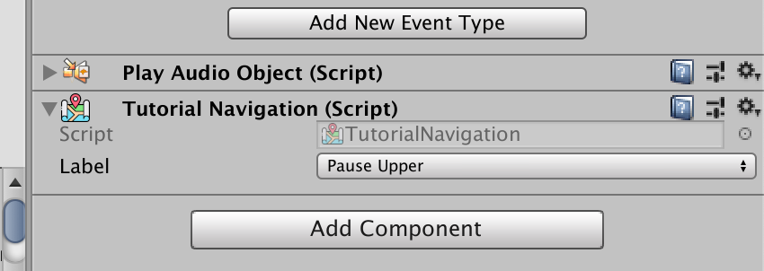

# Walkthrough — Beacons

After following the [guidelines](guideline.md), you can use Minefield for the benefits below.

## Assembly planning

You will have three kinds of `asmdef`:

1. **Core** — holds the `static` variables that influence each scene, among other things.
2. **Scene** — references core to read the `static` variable, or to set another scene's `static` before navigating there.
3. **Test** — also references core to change the `static` before each test. It may optionally reference scene assemblies.

Even if you reference a scene `asmdef`, asserting on its exposed fields is poor test design — you would only use them as portals to jump to what you actually want to test, and you would be tempted to expose more fields just to reach things. (Exposed fields should be `[SerializeField] private` rather than `public` anyway, so tests can't use them.) Minefield's [reporters](reporters.md) combined with beacons should take that job instead.

## `SceneTest`

Subclass `SceneTest` in your test assembly:

- Each subclass is a collection of cases for a single scene; the `abstract` `Scene` property asks you for the name.
- Each case is a fresh start of that scene — the built-in `[SetUp]`/`[TearDown]` handle it.
- You call `ActivateScene()` **manually**, which is your chance to hack the `static` variable before the scene starts, without repeating the scene name per case.
- Thanks to `[UnitySetUp]`, the scene is fully loaded before the case begins and only needs activation.
- As with C# generally, `static` variables **carry over** between cases (there is no domain reload — a deliberate performance win). Always set up your `static` explicitly, even to `default`/`new`, in your own `[SetUp]`/`[UnitySetUp]`.
- Conversely, *not* touching a `static` is a statement that the test passes regardless of its value. If a test fails from spilled-over state, prefer fixing the game to truly ignore the unrelated value over resetting it in the test.

## Test beacons

A beacon attaches an `enum` to a `GameObject` via a `MonoBehaviour` carrying that `enum`. It makes tests self-describing and auto-completable — no `GameObject.Find` on a refactorable string name, and no `.transform.GetChild` hierarchy crawling.

### Declare a label

First declare an `enum` — the beacon's **label** — representing all possible actions in a scene. It's like a Flux/Redux action, but it can also mark any checkpoint. Nest it in a class so names can be reused across scenes:

```csharp
public class ModeSelectScreen : MonoBehaviour
{
    public enum Navigation
    {
        SwitchCharacter, ChangeName, Garden, TwoPlayers,
        Training, Arcade, ShowOption, HideOption, Back
    }
}
```

Don't insert a new entry between existing ones later — Unity serializes by `int`, so it would shift old serialized values. Pin values with explicit integers if needed.

### Subclass an attachable beacon component

Declare a class using your `enum` as the generic argument of `NavigationBeacon<>` (for things clicked through the uGUI event system) or `LabelBeacon<>` (for any object you just want to find or assert). Put each in its own file so it gets its own `.meta` and GUID:

```csharp
using E7.Minefield;
public class ModeSelectNavigationBeacon : NavigationBeacon<ModeSelectScreen.Navigation> { }
```

Attach it in the scene. For a `NavigationBeacon<>`, attach it on the raycast-receiving element. Minefield **bubbles events up** like the uGUI event system, so attaching the beacon on a button's child text still works — the raycast hits the text, finds no handler, and bubbles up to the button.

### Script icon tool



Choose **Assets ▸ Minefield ▸ Auto-assign all script icons** and every subclass of `NavigationBeacon<>` or `LabelBeacon<>` gets an icon, making beacons obvious in the Inspector.

### Other tricks

Type `LabelBeacon` or `NavigationBeacon` in the Scene view search box to list every beacon added so far — possible because each generic subclass derives from a non-generic base.

### `HandlerBeacon`

The hierarchy is `NavigationBeacon` : `HandlerBeacon` : `LabelBeacon`. Use `HandlerBeacon` like `NavigationBeacon` for a clickable object that isn't really scene *navigation* — an on-screen jump button in an endless runner, for example. It behaves identically for clicking, but some future features (like automatic analytics logging) will be exclusive to navigation, where per-press logging makes more sense.
