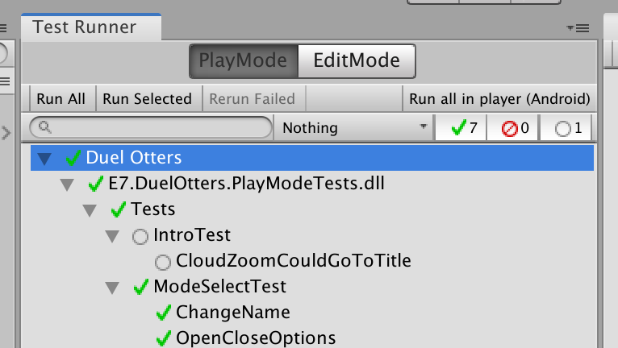
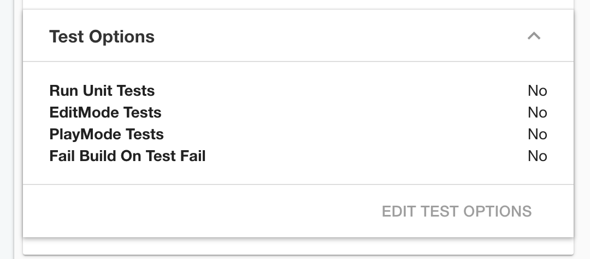

# Testable Project Guideline

Minefield works best when the game is designed to be testable. These guidelines describe how to structure scenes, state, and navigation so a scene can be tested in isolation.

## A scene for a testable unit, a prefab for content composition

- A **single** `Scene` is a testable unit. If you don't think you can test a scene individually, don't make it a scene — compose content with nested prefabs (2018.3+) instead of multiple scenes. If your game always works on several scenes at once in edit mode, it is going against this library.
- Every scene must work by itself under `LoadSceneMode.Single`; avoid `LoadSceneMode.Additive`. A non-additive scene can still load asynchronously — it just cleans up the previous objects when it activates. (The backing store of improved prefabs is the scene data structure, so prefabs *are* scenes now.)
- You never set an active scene, because you always have exactly one. Minefield assumes the active scene is the one under test and cleanly destroys everything between tests.
- Every scene must pass a "lazy man's test": load it, wait a bit, and it should not error. A scene that requires other scenes to function breaks this — and if you follow the guideline, such a scene doesn't exist.
- You must be able to press play on any scene and start from it, however "wrong" the game state feels. If the final boss room is a scene, you should be able to start there even with a level-1 character. Correct *state* is supplied separately (next section), but starting must never be an error.

## A `static` variable to influence the scene

A scene may only change its starting behaviour because of **external** `static` variables. This turns out to be exactly what `static` is for — a single, shared source of data that the test and the real game both read the same way. The cost is that you must clean up residual values between runs (treat it like a native resource you manage deliberately).

- It must be possible to set this `static` state to produce every possible outcome *before* the scene starts. For a title screen that sometimes plays an intro, keep a single `bool` — the title reads it and doesn't care who set it. The previous scene sets it; it never inspects the destination scene.
- Put the `static` on a separate `asmdef` that scenes reference, so (thanks to the circular-dependency restriction) it cannot depend on any scene's types. That forces primitive or scene-agnostic data (save-data structs, manager structs) rather than scene-specific objects.
- Prefer filling the `static` with `struct` so a usable default exists without initialization. When you need a `class` or `List`, use `[RuntimeInitializeOnLoad]` (remember unit tests skip it; play mode tests run it) or a `null` check.
- No `static` configuration — including defaults — should error on starting any scene.
- Don't rely on leftover GameObjects from a previous scene, on inspector-exposed fields to customize starting behaviour, or on loading a save file inside a scene object's `Awake`/`Start`. Do disk loading in a scene-agnostic `[RuntimeInitializeOnLoad]` entry point instead.
- A scene may not hack **its own** `static` variable; it can only set *another* scene's `static` to navigate there. (Same-scene transitions, e.g. a language change that refreshes the scene, are an exception.)
- As an alternative to `static` tweaks, you can vary behaviour with a [prefab variant](https://docs.unity3d.com/Manual/PrefabVariants.html) placed in a separate scene — e.g. a `TwoPlayerCharacterSelect` scene and a `SinglePlayerCharacterSelect` variant scene — which keeps each scene a test unit and lets you preview the difference at design time.

With this design you can drop the kind of test that starts at the beginning of the game and walks many steps to reach a destination. Limit side effects to `static`, and you can test each scene plus just one level of its transition. For `A → B → C`, you write `A → B` and `B → C`, never `A → C`.

## Keeping navigation in check

Games are full of animation and transitions, and a classic bug is letting the user interact when they shouldn't — mid-transition, or on the first/last frame. Your job is to **prevent** navigation objects from being clicked when appropriate. In manual testing this is the "can you break it" spam test; in automated testing, blindly waiting *N* seconds is fragile (too long wastes time, too short hits nothing).

Minefield's answer is to **try every frame** until the interaction is allowed — better than manual testing because no frame is missed. The "wait until clickable, then click" methods wait out transitions **without knowing their length**. What counts as clickable:

- If a raycast can hit the object **first** (uGUI `IPointerDown/Up/ClickHandler`, e.g. `EventTrigger`), the test assumes it is safe to click. Prevent this with a parent `CanvasGroup` (`blocksRaycasts = false`), by clearing `raycastTarget`, disabling the receiver component or GameObject, or covering it with a raycast-blocking transparent `Image` (common for popups).
- If the object is a `Selectable`, it blocks raycasts but does nothing when non-interactable, so Minefield adds a second criterion: it must also be `interactable`. Prevent interaction with a parent `CanvasGroup` (`interactable = false`) or by setting `interactable = false` on the `Selectable`.

## Ensure Unity's test toolings work

The **Run all in player** button lets you connect a device, press it, and walk away. To keep it dependable, avoid designs that break under it:

- Relying on the bundle name — it is set to `com.UnityTestRunner.UnityTestRunner`, which can break APIs like Firebase.
- Relying on the `DEVELOPMENT_BUILD` directive — the button turns it on, so your game must run correctly with it.
- Relying on manual post-build steps — the button sends the build straight to the device.

If you have [Unity Teams Advanced](https://unity.com/products/unity-teams), you can also use [Unity Cloud Build](https://unity.com/features/cloud-build)'s auto-test-per-build feature.

